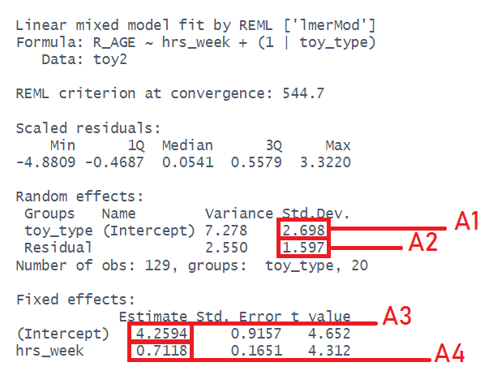

⬇️ [Download the .qmd](https://github.com/suyoghc/PSY504_Spring_2026/raw/main/posts/Multilevel%20Models/MLM_Lab.qmd)

## Instructions

-   If you are fitting a model, display the model output in a neatly formatted table. (The `tidy()` and `kable()` functions can help!)
-   If you are creating a plot, use clear labels for all axes, titles, etc.
-   Commit and push your work to GitHub regularly, at least after each exercise. Write short and informative commit messages.
-   When you're done, we should be able to knit the final version of the QMD in your GitHub as an HTML.

::: {.callout-important}
## How to work through this lab

Today's lab is not about "how to do analyses with multilevel models" — we will do that next week! Instead, the lab aims to get you thinking and help with an understanding of how mixed models work.

This is more of a **walkthrough** than a traditional assignment. Solutions are present in the file — but don't look at them immediately.

1. Create new chunks immediately after the questions with **your attempt** at a solution after spending some time with the question.
2. Then look at the solutions, and add brief comments on whether your answers diverged — if so, how?
:::

::: {.callout-tip}
## Workflow tip

Work through the lab by running chunks **one at a time** in RStudio (Cmd/Ctrl + Enter), not by rendering the whole document. Render only at the end, once all your code is working.

This is how most R users actually work — you'd write a line, run it, check the output, and iterate. Rendering is for producing the final document. When you render, Quarto starts a fresh R session and runs every chunk top-to-bottom, so if anything is incomplete, everything downstream breaks. When you work interactively using chunks, your environment builds up as you go, so you always have your objects available to inspect and troubleshoot.

The **"Run All Chunks Above"** button (downward arrow with a bar, next to the green play button in each chunk) is another useful tool. It re-runs everything from the top of the document up to your current chunk, so all your objects are up to date before you start working on the next question.
:::

## Setup

```{r}
#| code-fold: false
library(tidyverse)
library(lme4)
library(broom.mixed)
library(lmerTest)
library(patchwork)
library(ggdist)
library(effects)
library(gt)
library(parameters)
library(knitr)
```

------------------------------------------------------------------------

# Part 1: Getting to grips with MLM

::: {.callout-note}
These exercises are not "how to do analyses with multilevel models" — they are designed to get you thinking, and help with an understanding of how these models work.
:::

::: {.callout-note}
#### Data: New Toys!

Let's consider a linear regression scenario with a toy dataset.
Analysis question: How does practice influence the reading age of toy characters?
Dataset link: [https://uoepsy.github.io/data/toy2.csv](https://uoepsy.github.io/data/toy2.csv) contains information on 129 different toy characters that come from a selection of different families/types of toy.

You can see the variables in the table below.

:::: {.columns}
::: {.column width="45%"}
```{r echo=FALSE, out.width="300px",fig.align="center"}
knitr::include_graphics("images/toys.png")
```
:::
::: {.column width="10%"}
:::
::: {.column width="45%"}
```{r echo=FALSE, message=FALSE,warning=FALSE}
toy2 <- read_csv("https://uoepsy.github.io/data/toy2.csv")
tibble(variable=names(toy2),
       description=c("Type of Toy","Year Released","Character","Hours of practice per week","Reading Age")
) %>% gt()

```
:::
::::
:::

### Question 1

Below is some code that fits a model of "reading age" (`R_AGE`) predicted by hours of practice (`hrs_week`). Line 2 then gets the 'fitted' values from the model and adds them as a new column to the dataset, called `pred_lm`. The fitted values are what the model predicts for every individual observation (every individual toy in our dataset).

Lines 4–7 then plot the data, split up by each type of toy, and add lines showing the model fitted values.

Run the code and check that you get a plot. What do you notice about the lines?

```{r}
#| eval: false
#| code-line-numbers: true
lm_mod <- lm(R_AGE ~ hrs_week, data = toy2)
toy2$pred_lm <- predict(lm_mod)

ggplot(toy2, aes(x = hrs_week)) +
  geom_point(aes(y = R_AGE), size=1, alpha=.3) +
  facet_wrap(~toy_type) +
  geom_line(aes(y=pred_lm), col = "red")
```

```{r}
###The lines all look very similar across different sorts of toys. So this would suggest that reading age is predicted by hours of practice, and we can't say anything about toy type yet it seems since the model doesn't include this as a predictor.


```


::: {.callout-tip collapse="true"}
#### Solution

We should get something like this:
```{r}
lm_mod <- lm(R_AGE ~ hrs_week, data = toy2)
toy2$pred_lm <- predict(lm_mod)

ggplot(toy2, aes(x = hrs_week)) +
  geom_point(aes(y = R_AGE), size=1, alpha=.3) +
  facet_wrap(~toy_type) +
  geom_line(aes(y=pred_lm), col = "red")
```

Note that the lines are exactly the same for each type of toy. This makes total sense, because the model (which is where we've got the lines from) completely _ignores_ the `toy_type` variable!
:::

```{r}
#I didn't think about the idea that toy_type, when incorporated, might make the grouping matter. This could be an important item to model with random effects. 


```

### Question 2

Below are 3 more code chunks that all 1) fit a model, then 2) add the fitted values of that model to the plot.

The first model is a 'no-pooling' approach, where we simply add in `toy_type` as a predictor in the model to estimate all the differences between types of toys.

The second and third are multilevel models. The second fits random intercepts by toy type, and the third fits random intercepts and slopes of `hrs_week`.

Copy each chunk and run through the code. Pay attention to how the lines differ.

```{r}
#| eval: false
#| code-fold: true
fe_mod <- lm(R_AGE ~ toy_type + hrs_week, data = toy2)
toy2$pred_fe <- predict(fe_mod)

ggplot(toy2, aes(x = hrs_week)) +
  geom_point(aes(y = R_AGE), size=1, alpha=.3) +
  facet_wrap(~toy_type) +
  geom_line(aes(y=pred_fe), col = "blue")
```

```{r}
#| eval: false
#| code-fold: true
ri_mod <- lmer(R_AGE ~ hrs_week + (1 | toy_type), data = toy2)
toy2$pred_ri <- predict(ri_mod)

ggplot(toy2, aes(x = hrs_week)) +
  geom_point(aes(y = R_AGE), size=1, alpha=.3) +
  facet_wrap(~toy_type) +
  geom_line(aes(y=pred_ri), col = "green")
```

```{r}
#| eval: false
#| code-fold: true
rs_mod <- lmer(R_AGE ~ hrs_week + (1 + hrs_week | toy_type), data = toy2)
toy2$pred_rs <- predict(rs_mod)

ggplot(toy2, aes(x = hrs_week)) +
  geom_point(aes(y = R_AGE), size=1, alpha=.3) +
  facet_wrap(~toy_type) +
  geom_line(aes(y=pred_rs), col = "orange")
```

```{r}
#In the first model with have a regular linear model without random effects. The main difference between the first graph and the second visually is that in the second the lines are pulled closer together (but have the same slope). From what I understand, this is because in the first model each toy type is assumed to be totally independent from the others, whereas in the second, the intercepts all come from the same underlying population, so toy types with less kids are pulled towards the mean intercept. In the third, we have a random slope, so the relationship between hours per week and age is assumed to be potentially different for every kind of toy. For me, the third is the easiest to understand, and the shrinkage between 1/2 is harder to conceptually grasp.


```


::: {.callout-tip collapse="true"}
#### Solution

The first model has an adjustment for each toy-type (we can see this in the coefficients if we want). What this means is that the line for each type of toy is shifted up or down. We can see that the lines are now shifted up for things like "Scooby Doo" and "G.I.Joe", and down for "transformers" and "farm animals":
```{r}
fe_mod <- lm(R_AGE ~ toy_type + hrs_week, data = toy2)
toy2$pred_fe <- predict(fe_mod)

ggplot(toy2, aes(x = hrs_week)) +
  geom_point(aes(y = R_AGE), size=1, alpha=.3) +
  facet_wrap(~toy_type) +
  geom_line(aes(y=pred_fe), col = "blue")
```


This next one _looks_ very similar to the previous one, but it is conceptually doing something a bit different. Rather than separating out and estimating differences between all the toy-types, we are modelling _a distribution_ of deviations for each type from some average.


```{r}
ri_mod <- lmer(R_AGE ~ hrs_week + (1 | toy_type), data = toy2)
toy2$pred_ri <- predict(ri_mod)

ggplot(toy2, aes(x = hrs_week)) +
  geom_point(aes(y = R_AGE), size=1, alpha=.3) +
  facet_wrap(~toy_type) +
  geom_line(aes(y=pred_ri), col = "green")
```

Finally, we can add in the random slopes of `hrs_week`. In this model, we are not only allowing toy-types to vary in their average reading age (i.e. shifting lines up and down), but we are also allowing them to vary in the association between hrs_week and reading age (letting the lines have different slopes). Some types of toy (Scooby Doo, Sock Puppets, Stretch Armstrong) have fairly positive slopes, and some have a flatter association (e.g., SuperZings etc).

```{r}
rs_mod <- lmer(R_AGE ~ hrs_week + (1 + hrs_week | toy_type), data = toy2)
toy2$pred_rs <- predict(rs_mod)

ggplot(toy2, aes(x = hrs_week)) +
  geom_point(aes(y = R_AGE), size=1, alpha=.3) +
  facet_wrap(~toy_type) +
  geom_line(aes(y=pred_rs), col = "orange")
```
:::

```{r}
#I think conceptually for the third model my answer basically matched, I get that we are letting there be a separate potential relationship between the variables for each toy type. For the second model, I think I am still unsure about what it is about introducing the random intercept that causes us to be modeling a distribution of deviations from the same point.
```


### Question 3

From the previous questions you should have a model called `ri_mod`.

Below is a plot of the fitted values from that model. Rather than having a separate facet for each type of toy as we did above, I have put them all on one plot. The thick black line is the average intercept and slope of the toy-type lines.

Identify the parts of the plot that correspond to A1–4 in the summary output of the model below.

:::: {.columns}
::: {.column width="50%"}
```{r}
#| echo: false
#| out-width: "100%"

```
:::
::: {.column width="50%"}
```{r}
#| echo: false
#| out-width: "100%"
broom.mixed::augment(ri_mod) |>
  ggplot(aes(x=hrs_week, col=toy_type))+
  geom_point(aes(y=R_AGE),alpha=.5) + # observations
  geom_line(aes(y=.fitted)) + # predictions
  geom_abline(intercept = fixef(ri_mod)[1],
              slope = fixef(ri_mod)[2], lwd=1)  # fixed effect line
```
:::
::::

::: {.callout-tip collapse="true"}
#### Hints

Choose from these options:

+ where the black line cuts the y axis (at x=0)
+ the slope of the black line
+ the standard deviation of the distances from all the individual datapoints (toys) to their respective toy-type lines
+ the standard deviation of the distances from all the toy-type lines to the black line

:::

```{r}
#The place where the black line cuts the y axis is the fixed effect intercept, the estimated age for a child who plays for 0 hours per week (A3). The slope represents the average relationship between hours per week and age (so NOT modeling the slope per each toy type), this would be the fixed effect slope (A4). The SD of the distances from the individual datapoints to their line would correspond to A2, the residual SD. Finally, the SD of all toy types to the black line would be A1, the intercept SD (representing within group variation)


```


::: {.callout-tip collapse="true"}
#### Solution

+ **A1** = the standard deviation of the distances from all the toy-type lines to the black line
+ **A2** = the standard deviation of the distances from all the individual datapoints (toys) to their respective toy-type lines
+ **A3** = where the black line cuts the y axis
+ **A4** = the slope of the black line
:::

```{r}
#My answers did not differ, but I had the hardest time thinking about how to relate A1 and A2 to what the different sorts of MLM are taking into account. 


```

### Question 4 (Optional)

Below is the model equation for the `ri_mod` model.

Identify the part of the equation that represents each of A1–4.

:::: {.columns}
::: {.column width="50%"}
```{r}
#| echo: false
#| out-width: "100%"

```
:::

::: {.column width="50%"}
<div style="font-size: .7em">

\begin{align}
\text{For Toy }j\text{ of Type }i & \\
\text{Level 1 (Toy):}& \\
\text{R\_AGE}_{ij} &= b_{0i} + b_1 \cdot \text{hrs\_week}_{ij} + \epsilon_{ij} \\
\text{Level 2 (Type):}& \\
b_{0i} &= \gamma_{00} + \zeta_{0i} \\
\text{Where:}& \\
\zeta_{0i} &\sim N(0,\sigma_{0}) \\
\varepsilon &\sim N(0,\sigma_{e}) \\
\end{align}

</div>

:::
::::

::: {.callout-tip collapse="true"}
#### Hints

Choose from:

+ $\sigma_{\varepsilon}$
+ $b_{1}$
+ $\sigma_{0}$
+ $\gamma_{00}$

:::

```{r}
#ENTER YOUR ATTEMPT AND THOUGHTS HERE:
#(The image for the equation is I think not working on my end of R so I'm just going to state what each one would be)
#b1 is going to be the fixed slope, and gamma would be the intercept. I'm not actually sure which of the two 
#(sigma and sigma varepsilon) would represent the SD of the individual points to toy lines vs types to black lines
```


::: {.callout-tip collapse="true"}
#### Solution

+ **A1 =** $\sigma_{0}$
+ **A2 =** $\sigma_{\varepsilon}$
+ **A3 =** $\gamma_{00}$
+ **A4 =** $b_{1}$
:::

```{r}
#Covered in the previous note.


```

------------------------------------------------------------------------

# Part 2: Audio Interference in Executive Functioning (Repeated Measures)

::: {.callout-note}
This next set of exercises is closer to conducting a real study. We have some data and a research question (below). The exercises will walk you through describing the data, then prompt you to think about how we might fit an appropriate model to address the research question, and finally task you with having a go at writing up what you've done.
:::


```{r}
#| include: false
set.seed(5)
n_groups = 30
N = n_groups*3*5
g = rep(1:n_groups, e = N/n_groups)

w = rep(rep(letters[1:3],5),n_groups)
w1 = model.matrix(lm(rnorm(N)~w))[,2]
w2 = model.matrix(lm(rnorm(N)~w))[,3]

b = rep(0:1, e = N/2)

re0 = rnorm(n_groups, sd = 2)[g]
re_w1  = rnorm(n_groups, sd = 1)[g]
re_w2  = rnorm(n_groups, sd = 1)[g]

lp = (0 + re0) +
  (3)*b +
  (0 + re_w1)*w1 +
  (-2 + re_w2)*w2 +
  (2)*b*w1 +
  (-1)*b*w2

y = rnorm(N, mean = lp, sd = 1.5) # create a continuous target variable

df <- data.frame(w, g=factor(g),b, y)
head(df)
with(df,boxplot(y~interaction(w,b)))

library(tidyverse)
df %>% transmute(
  PID = paste0("PPT_",formatC(g,width=2,flag=0)),
  audio = fct_recode(factor(w),
                     no_audio = "a",
                     white_noise = "b",
                     music = "c"),
  headphones = fct_recode(factor(b),
                          speakers = "0",
                          anc_headphones = "1"),
  SDMT = pmax(0,round(35 + scale(y)[,1]*12))
) %>% arrange(PID,audio,headphones) -> ef_music

ef_music <- ef_music %>% group_by(PID) %>%
  mutate(trial_n = paste0("Trial_",formatC(sample(1:15),width=2,flag=0))) %>%
  arrange(PID,trial_n) %>% ungroup()

efrep <- slice_sample(ef_music, prop = .8) %>% select(PID,trial_n,audio,headphones,SDMT)
```

::: {.callout-note}
#### Data: Audio interference in executive functioning

This data is from a simulated study that aims to investigate the following research question:

> How do different types of audio interfere with executive functioning, and does this interference differ depending upon whether or not noise-cancelling headphones are used?

`r length(unique(efrep$PID))` healthy volunteers each completed the Symbol Digit Modalities Test (SDMT) — a commonly used test to assess processing speed and motor speed — a total of 15 times. During the tests, participants listened to either no audio (5 tests), white noise (5 tests) or classical music (5 tests). Half the participants listened via active-noise-cancelling headphones, and the other half listened via speakers in the room. Unfortunately, lots of the tests were not administered correctly, and so not every participant has the full 15 trials worth of data.

The data is available at [https://uoepsy.github.io/data/lmm_ef_sdmt.csv](https://uoepsy.github.io/data/lmm_ef_sdmt.csv).

```{r}
#| echo: false
efrep <- read_csv("https://uoepsy.github.io/data/lmm_ef_sdmt.csv")
tibble(variable=names(efrep),
       description = c(
         "Participant ID",
         "Audio heard during the test ('no_audio', 'white_noise','music')",
         "Whether the participant listened via speakers (S) in the room or via noise cancelling headphones (H)",
         "Symbol Digit Modalities Test (SDMT) score")
) %>% gt::gt()
```
:::

### Question 5

How many participants are there in the data?
How many have complete data (15 trials)?
What is the average number of trials that participants completed? What is the minimum?
Does every participant have _some_ data for each type of audio?

::: {.callout-tip collapse="true"}
#### Hints

Functions like `table()` and `count()` will likely be useful here.
:::


```{r}
#ENTER YOUR ATTEMPT HERE:
n_distinct(efrep$PID) #30 participants total
#Wasn't sure how to check the second easily
efrep |>
  count(PID) |>
  summarise(
    mean_trials = mean(n),
    min_trials  = min(n)
  ) #Mean = 12, minimum = 10
efrep |>
  group_by(PID) |>
  summarise(n_audio_types = n_distinct(audio)) |>
  count(n_audio_types) #Everyone has some kind of audio type
``` 


::: {.callout-tip collapse="true"}
#### Solution — read in the data
```{r}
efdat <- read_csv("https://uoepsy.github.io/data/lmm_ef_sdmt.csv")
head(efdat)
```
:::

::: {.callout-tip collapse="true"}
#### Solution — how many participants?
For a quick "how many?", functions like `n_distinct()` can be handy:
```{r}
n_distinct(efdat$PID)
```

Which is essentially the same as asking:
```{r}
unique(efdat$PID) |> length()
```
:::

::: {.callout-tip collapse="true"}
#### Solution — how many observations per participant?
Here are the counts of trials for each participant.
```{r}
#| eval: false
efdat |>
  count(PID)
```
```{r}
#| echo: false
efdat |>
  count(PID) |>
  print(n=5)
```

We can pass that to something like `summary()` to get a quick descriptive of the `n` column, and so we can see that no participant completed all 15 trials (max is 14). Everyone completed at least 10, and the median was 12.
```{r}
efdat |>
  count(PID) |>
  summary()
```

We could also do this easily with things like:
```{r}
table(efdat$PID) |> median()
```
:::

::: {.callout-tip collapse="true"}
#### Solution — observations for each audio type per participant?
For this kind of thing I would typically default to using `table()` for smaller datasets, to see how many datapoints are in each combination of `PID` and `audio`:
```{r}
table(efdat$PID, efdat$audio)
```

From the above, we can see that everyone has data from $\geq 2$ trials for a given audio type.

```{r}
table(efdat$PID, efdat$audio) |> min()
```


::: {.callout-tip collapse="true"}
#### A tidyverse way

When tables get too big, we can do the same thing with `count()`, but we need to make sure that we are working with factors, in order to summarise all possible combinations of groups (even empty ones):
```{r}
efdat |>
  mutate(PID = factor(PID),
         audio = factor(audio)) |>
  # the .drop=FALSE means "keep empty groups"
  count(PID,audio,.drop=FALSE) |>
  summary()
```

There are plenty of other ways (e.g., you could use combinations of `group_by()`, `summarise()`), so just pick one that makes sense to you.
:::
:::

```{r}
#Not exactly, I wasn't sure how to do the second operation and I liked using table to easily visualize the differences between subjects here.


```

### Question 6

> How do different types of audio interfere with executive functioning, and does this interference differ depending upon whether or not noise-cancelling headphones are used?

Consider the following questions about the study:

- What is our outcome of interest?
- What variables are we seeking to investigate in terms of their impact on the outcome?
- What are the units of observations?
- Are the observations clustered/grouped? In what way?
- What varies *within* these clusters?
- What varies *between* these clusters?

```{r}
#ENTER YOUR ATTEMPT HERE:

#The test scores for executive functioning
#We are seeking to investigate how different types of audio interfaces affect this, and then the effect of noise cancelling headphones
#Trials
#Participants (repeated measures for each)
#Each participant hears different sorts of audio
#Not sure

```
### 

::: {.callout-tip collapse="true"}
#### Solution

- What is our outcome of interest?
    + __SDMT scores__
- What variables are we seeking to investigate in terms of their impact on the outcome?
    + __audio type__ and the interaction __audio type $\times$ wearing headphones__
- What are the units of observations?
    + __individual trials__
- What are the groups/clusters?
    + __participants__
- What varies *within* these clusters?
    + __the type of audio__
- What varies *between* these clusters?
    + __whether they listen via headphones or speakers__
:::

```{r}
#I wasn't sure what the between group differences were, but checking the answer and the dataset it was the sort of device they used to listen.


```

### Question 7

Make factors and set the reference levels of the `audio` and `headphones` variables to "no audio" and "speakers" respectively.


::: {.callout-tip collapse="true"}
#### Hints

Check back to the Multiple Regression materials for a refresher on setting factors and reference levels.
:::


```{r}
#ENTER YOUR ATTEMPT HERE:
efdat <- efdat |>
  mutate(
    audio = fct_relevel(factor(audio), "no_audio"),
    headphones = fct_relevel(factor(headphones), "S")
  )

```


::: {.callout-tip collapse="true"}
#### Solution

```{r}
efdat <- efdat |>
  mutate(
    audio = fct_relevel(factor(audio), "no_audio"),
    headphones = fct_relevel(factor(headphones), "S")
  )
```
:::

```{r}
No difference


```

### Question 8

Fit a multilevel model to address the aims of the study (copied below):

> How do different types of audio interfere with executive functioning, and does this interference differ depending upon whether or not noise-cancelling headphones are used?

Specifying the model may feel like a lot, but try splitting it into three parts:

$$
\text{lmer(}\overbrace{\text{outcome }\sim\text{ fixed effects}}^1\, + \, (1 + \underbrace{\text{slopes}}_3\, |\, \overbrace{\text{grouping structure}}^2 )
$$


1. Just like the `lm()`s we have used in the past, think about what we want to _test_. This should provide the outcome and the structure of our fixed effects.
2. Think about how the observations are clustered/grouped. This should tell us how to specify the grouping structure in the random effects.
3. Think about which slopes (i.e. which terms in our fixed effects) could feasibly vary between the clusters. This provides you with what to put in as random slopes.


::: {.callout-tip collapse="true"}
#### Hints

For additional reading on multilevel models and how to fit them in R, see [Chapter 2: Multilevel Models in R](https://uoepsy.github.io/lmm/02_lmm.html#multilevel-models-in-r){target="_blank"}.
:::


```{r}
#ENTER YOUR ATTEMPT HERE:
model <- lmer(SDMT ~ audio * (1 + headphones|PID), data = ef_music)
#Upon reading below, I realized that we don't want to be grouping by headphones as it's also a variable of interest

```


::: {.callout-tip collapse="true"}
#### Solution — fixed effects

The question
"*How do different types of audio interfere with executive functioning*" means we are interested in the effects of audio type (`audio`) on executive functioning (`SDMT` scores), so we will want:

```
lmer(SDMT ~ audio ...
```

However, the research aim also asks
"*... and does this interference differ depending upon whether or not noise-cancelling headphones are used?*"
which suggests that we are interested in the interaction `SDMT ~ audio * headphones`

```
lmer(SDMT ~ audio * headphones + ...
```
:::

::: {.callout-tip collapse="true"}
#### Solution — hierarchical data structure

There are lots of ways that our data is grouped.
We have:

- 3 different groups of audio type (`r paste(unique(efdat$audio),collapse=", ")`)
- 2 groups of listening condition (`r paste(unique(efdat$headphones),collapse=", ")`)
- 30 groups of participants ("PPT_01", "PPT_02", "PPT_03", ...)

The effects of audio type and headphones are both things we actually want to _test_ — these variables are in our fixed effects. The levels of audio and headphones are not just a random sample from a wider population of levels — they're a specific set of things we want to compare SDMT scores between.

Compare this with the participants — we don't care about if there is a difference in SDMT scores between e.g., "PPT_03" and "PPT_28". The participants themselves are just a sample of people that we have taken from a wider population. This makes thinking of "by-participant random effects" a sensible approach — we model differences between participants as a normal distribution of deviations around some average:

```
lmer(SDMT ~ audio * headphones + (1 + ... | PID)
```

The minimum that we can include is the random intercept. What `(1|PID)` specifies is that "participants vary in their SDMT scores". This makes sense — we would expect some participants to have higher executive functioning (and so will tend to score high on the SDMT), and others to have lower functioning (and so tend to score lower).
:::

::: {.callout-tip collapse="true"}
#### Solution — random slopes

We can also include a random by-participant effect of `audio`.
`audio|PID` specifies that the effect of audio type on SDMT varies by participant. This seems feasible — music might be very distracting (and interfere a lot with the test) for some participants, but have a negligible effect for others.

```
lmer(SDMT ~ audio * headphones +
              (1 + audio | PID), data = efdat)
```


::: {.callout-tip collapse="true"}
#### Why can't we have `(headphones|PID)`?

Why can we fit `(1 + audio | PID)` but not `(1 + headphones | PID)`, or both `(1 + audio + headphones | PID)` or `(1 + audio * headphones | PID)`?

Remember that `y ~ ... + (x | g)` is saying "the slope of y~x varies by g".
Such a sentence only makes sense if "the slope of y~x" is defined for every (or most) groups.

For the `headphones` predictor, every participant is _either_ in the "S" (speakers) condition _or_ the "H" (headphones) condition.
This means that "the effect of headphones on SDMT" _doesn't exist_ for any single participant! This means it makes no sense to try and think of the effect as 'varying by participant'.

Compare this to the `audio` predictor, for which the effect _does_ exist for a single given participant, therefore it is possible to think of it as being different for different participants (e.g. PPT_30's performance improves with white noise, but PPT_16's performance does not).

The plots below may help to cement this idea:

```{r}
#| echo: false
library(lattice)
bwplot(SDMT~headphones|PID, data = efdat, scales=list(x=list(rot=90)))

bwplot(SDMT~audio|PID, data = efdat, scales=list(x=list(rot=90)))
```
:::
:::

```{r}
#Yes I wasn't thinking about the fact that headphones are themselves a predictor. For what to group by, since audio exists for each person, we can see how it varies for each person and so we can use it as the grouping variable in the lmer model.


```

### Question 9

We now have a model, but we don't have any p-values or confidence intervals or anything — i.e. we have no inferential criteria on which to draw conclusions. There are a whole load of different methods available for drawing inferences from multilevel models, which means it can be a bit of a never-ending rabbit hole. For now, we'll just use the 'quick and easy' approach provided by the **lmerTest** package seen in the lectures.

Using the **lmerTest** package, re-fit your model, and you should now get some p-values!
::: {.callout-tip collapse="true"}
#### Hints

If you use `library(lmerTest)` to load the package, then *every single* model you fit will show p-values calculated with the Satterthwaite method.
Personally, I would rather this is not the case, so I often opt to fit specific models with these p-values without ever loading the package:
`modp <- lmerTest::lmer(y ~ 1 + x + ....`
:::

::: {.callout-caution collapse="true"}
#### Optional: a model comparison

If we want to go down the model comparison route, we just need to isolate the relevant part(s) of the model that we are interested in.

Remember, model comparison is sometimes a useful way of testing a _set_ of coefficients. For instance, in this example the interaction involves estimating _two_ terms:
`audiomusic:headphonesH` and `audiowhite_noise:headphonesH`.

To test the interaction as a whole, we can create a model without the interaction, and then compare it. The `SATmodcomp()` function from the __pbkrtest__ package provides a way of conducting an F test with the same Satterthwaite method of approximating the degrees of freedom:

```{r}
sdmt_mod <- lmer(SDMT ~ audio * headphones +
              (1 + audio | PID), data = efdat)
sdmt_res <- lmer(SDMT ~ audio + headphones +
                   (1 + audio | PID), data = efdat)
library(pbkrtest)
SATmodcomp(largeModel = sdmt_mod, smallModel = sdmt_res)
```
:::


```{r}
library(lmerTest)
summary(model)


```


::: {.callout-tip collapse="true"}
#### Solution

```{r}
sdmt_mod <- lmerTest::lmer(SDMT ~ audio * headphones +
              (1 + audio | PID), data = efdat)

summary(sdmt_mod)
```
:::

```{r}
#Yes I wasn't thinking about the fact that headphones are themselves a predictor. For what to group by, since audio exists for each person, we can see how it varies for each person and so we can use it as the grouping variable in the lmer model. We can see how mine wouldn't work because the model failed to converge and gave us a warning.


```

### Question 10

We've already seen in the example with the different types of toys (above) that we can visualise the fitted values (model predictions). But these were plotting all the cluster-specific values, and what we are really interested in are the estimates of (and uncertainty around) our *fixed effects* (i.e. estimates for clusters *on average*).

Using tools like the __effects__ package can provide us with the values of the outcome across levels of a specific fixed predictor (holding other predictors at their mean).

This should get you started:
```{r}
#| eval: false
library(effects)
effect(term = "audio*headphones", mod = sdmt_mod) |>
  as.data.frame()
```


::: {.callout-tip collapse="true"}
#### Hints

For additional reading, see [Chapter 2: Visualising Models](https://uoepsy.github.io/lmm/02_lmm.html#visualising-models){target="_blank"}. The logic is just the same as for regular regression — it's just that the estimated effects are from an `lmer()` instead of an `lm()`/`glm()`.
:::


```{r}
#ENTER YOUR ATTEMPT HERE:
library(effects)

effect(term = "audio*headphones", mod = sdmt_mod) |>
  as.data.frame() |>
  ggplot(aes(x = audio, y = fit, color = headphones, group = headphones)) +
  geom_point() +
  geom_line() +
  geom_errorbar(aes(ymin = lower, ymax = upper), 
                width = 0.1,
                position = position_dodge(width = 0.3)) +
  labs(y = "SDMT scores")

```


::: {.callout-tip collapse="true"}
#### Solution
```{r}
library(effects)
effect(term = "audio*headphones", mod = sdmt_mod) |>
  as.data.frame() |>
  ggplot(aes(x=audio,y=fit,
             ymin=lower,ymax=upper,
             col=headphones))+
  geom_pointrange(size=1,lwd=1)
```
:::

```{r}
#Similar visualization, but I do think the one on the bottom is cleaner as there's no real reason to add the lines between points here.


```

### Question 11

Now we have some p-values and a plot, try to create a short write-up of the analysis and results.


::: {.callout-tip collapse="true"}
#### Hints

Think about the principles that have guided you during write-ups thus far.

The aim in writing a statistical report should be that a reader is able to more or less replicate your analyses **without** referring to your analysis code. Furthermore, it should be possible for a reader to understand and replicate your work _even if they use something other than R_. This requires detailing all of the steps you took in conducting the analysis, but without simply referring to R code.


- Provide a description of the sample that is used in the analysis, and any steps that you took to get this sample (i.e. data cleaning/removal)
- Describe the model/test and how it addresses the research question. What is the structure of the model, and how did you get to this model? *(You don't need a fancy model equation, you can describe in words!)*.
- Present (visually and numerically) the key results of the coefficient tests or model comparisons, and explain what these mean in the context of the research question (this could be things like practical significance of the effect size, and the group-level variability in the effects).
:::


```{r}
#ENTER YOUR ATTEMPT HERE:

broom.mixed::tidy(sdmt_mod, effects = "fixed")
confint(sdmt_mod, method = "Wald")
effect("audio*headphones", sdmt_mod) |> as.data.frame()

#The study in question examined how different sorts of audio interference affects executive function. The data set included executive functioning scores (SDMT), the type of headphones that were used (headphones), and the type of audio (audio). To evaluate this question, we modeled SDMT scores as a function of the headphones that were used, the type of audio listened to, and their interactions. We were specifically interested in whether the type of headphone used determined the interference of audio on SDMT. We used a model with random effects for the type of audio and intercepts for each participant, because each participant completed multiple trials and we expected them to differ in baseline SDMT and how audio affected them.

#The estimated baseline SDMT score (no audio, speakers) was 33.26 (SE = 1.99, 95% CI [29.35, 37.16]). Compared to no audio, music was associated with a significant decrease in SDMT scores (b = -8.02, SE = 1.41, t(27.59) = -5.68, p < .001), while white noise showed no significant effect (b = -0.03, SE = 1.45, t(26.33) = -0.02, p = .983).
#Participants using noise-cancelling headphones scored significantly higher than those using speakers in the no audio condition (b = 6.85, SE = 2.81, t(28.19) = 2.44, p = .021). The interaction between white noise and headphones was significant (b = 8.02, SE = 2.04, t(26.46) = 3.92, p < .001), indicating that white noise was associated with higher SDMT for headphone users (estimated SDMT = 48.11, 95% CI [44.16, 52.05]) compared to no audio. The interaction between music and headphones was not significant (b = -3.59, SE = 2.00, t(27.94) = -1.79, p = .084).

```


::: {.callout-tip collapse="true"}
#### Solution

::: {.callout-important}
This is not a perfect write-up (there's not really any such thing!).
:::

```{r}
#| echo: false
res = as.data.frame(parameters::model_parameters(sdmt_mod, ci_method="s"))
res[,c(2,3,5,6,7,8)] <- apply(res[,c(2,3,5,6,7,8)], 2, function(x) round(x, 2))
res[,9] <- format.pval(res[,9],eps=.001,digits=2)
res[,9][!grepl("<",res[,9])] <- paste0("=",res[,9][!grepl("<",res[,9])])

res2 = as.data.frame(VarCorr(sdmt_mod)) |> mutate(sdcor = round(sdcor,2))
```

SDMT scores were modelled using linear mixed effects regression, with fixed effects of audio-type (no audio/white noise/music, treatment coded with no audio as the reference level), audio delivery (speakers vs ANC-headphones, treatment coded with speakers as the reference level) and their interaction. Participant-level random intercepts and random slopes of audio-type were also included. The inclusion of the interaction term between audio-type and audio-delivery was used to address the question of whether the interference of different audio on executive function depends on whether it is heard via noise-cancelling headphones. A model comparison was conducted between the full model and a restricted model that was identical to the full model with the exception that the interaction term was excluded. Models were fitted using the **lme4** package in R, and estimated with restricted estimation maximum likelihood (REML). Denominator degrees of freedom for all comparisons and tests were approximated using the Satterthwaite method.

Inclusion of the interaction between headphones and audio-type was found to improve model fit ($F(2, 26.9) = 11.05, p < .001$), suggesting that the interference of different types of audio on executive functioning is dependent upon whether the audio is presented through ANC-headphones or through speakers.

Participants not wearing headphones and presented with no audio scored on average `r res[1,2]` on the SDMT. For participants without headphones, listening to music via speakers was associated with lower scores compared to no audio ($b = `r res[2,2]`, t(`r res[2,8]`)=`r res[2,7]`, p `r res[2,9]`$), but there was no significant difference between white noise and no audio.

With no audio playing, wearing ANC-headphones was associated with higher SDMT scores compared to those wearing no headphones ($b = `r res[4,2]`, t(`r res[4,8]`)=`r res[4,7]`, p `r res[4,9]`$).
The apparent detrimental effect of music on SDMT scores was not significantly different in the headphones condition compared to the no-headphones condition ($b = `r res[5,2]`, t(`r res[5,8]`)=`r res[5,7]`, p `r res[5,9]`$). Compared to those listening through speakers, white noise was associated with a greater increase in scores over no audio, when listening via ANC-headphones ($b = `r res[6,2]`, t(`r res[6,8]`)=`r res[6,7]`, p `r res[6,9]`$).

There was considerable variability in baseline (i.e. no-audio) SDMT scores across participants (SD = `r res2[1,5]`), with participants showing similar variability in the effects of music (SD = `r res2[2,5]`) and of white-noise (SD = `r res2[3,5]`). A weak negative correlation (`r res2[5,5]`) between participant-level intercepts and effects of white-noise indicated that people who score higher in the no-audio condition tended to be more negatively affected by white-noise. A similar weak negative correlation (`r res2[6,5]`) between music and white-noise effects suggests participants who were more positively affected by one type of audio tended to be more negatively affected by the other.

These results suggest that music appears to interfere with executive functioning (lower SDMT scores) compared to listening to no audio, and this is not dependent upon whether it is heard through headphones or speakers. When listening via speakers, white noise was not associated with differences in executive functioning compared to no audio, but this was different for those listening via headphones, in which white noise saw a greater increase in performance. Furthermore, there appear to be benefits for executive functioning from wearing ANC-headphones even when not listening to audio, perhaps due to the noise cancellation. The pattern of findings are displayed in @fig-efplot.


```{r}
#| label: fig-efplot
#| fig-cap: "Interaction between the type (no audio/white noise/music) and the delivery (speakers/ANC headphones) on executive functioning task (SDMT)"
#| echo: false
plotfit <- effect(term = "audio*headphones", mod = sdmt_mod) |>
  as.data.frame()

ggplot(efdat, aes(x=audio,y=SDMT,col=headphones))+
  geom_jitter(height=0,width=.2,alpha=.3) +
  geom_pointrange(data = plotfit,
                  aes(y=fit,ymin=lower,ymax=upper),
                  size=1,lwd=1)
```

```{r}
#| echo: false
sjPlot::tab_model(sdmt_mod,df.method="satterthwaite",
                  show.ci=F,show.stat=T,show.df=T)
```
:::

```{r}
#There were some details in the writeup answer that would have been good to include in mind, including mention of the software/packages I used, the model comparison, and the SDs for random effects and their correlations. The closing interpretation paragraph was also nice, for a full-fledged report this would be bettter

#Also, I wanted to comment that I thought this approach to labs was especially useful compared to other labs, particularly the part where we report answers and compare them to yours. I felt more comfortable making mistakes and then being able to check my interpretations immediately with feedback. I hope we do more like these!


```
